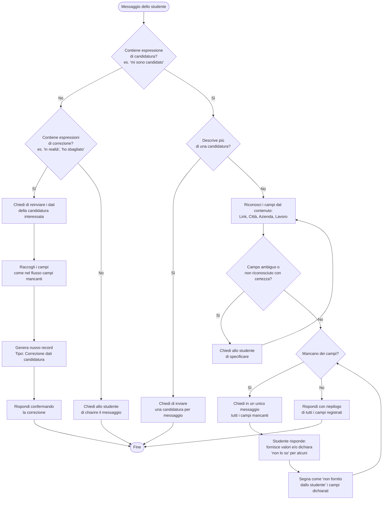

# Flowchart - AI Instructions (Scenario A)

Visualizzazione grafica della logica descritta in `AI_Instructions.md`.
Questo file non sostituisce il documento originale, serve solo per vederne il flusso con l'estensione Mermaid di VS Code.

