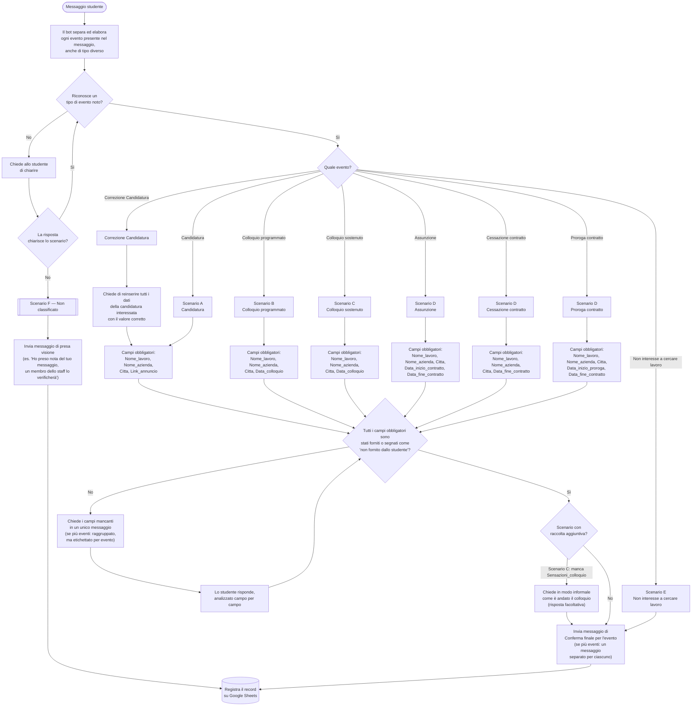

# Diagramma di flusso — AI_bot_instructions_20260805

Rappresenta la logica di `AI_bot_instructions_20260805.md`: dal messaggio dello studente al riconoscimento dello scenario, raccolta campi e registrazione su Google Sheets.

## Note di lettura

- **Riconoscimento campi opzionali** (`Nome_intervistatore`, `Link_annuncio` negli Scenari B/C): non è rappresentato come nodo a sé nel diagramma perché il bot non li richiede mai attivamente — vengono semplicemente registrati se presenti spontaneamente nel messaggio iniziale o nelle risposte dello studente, senza influenzare il gate "campi obbligatori completi".
- **Scenario E** (Non interesse a cercare lavoro) salta interamente la raccolta campi: non avendo campi obbligatori, passa direttamente alla Conferma finale.
- **Casi ambigui e fallback** (dato irriconoscibile, più valori per lo stesso campo) sono assorbiti nel ciclo "Chiede i campi mancanti → risposta studente", perché nella sintesi seguono la stessa logica di richiesta/attesa risposta.